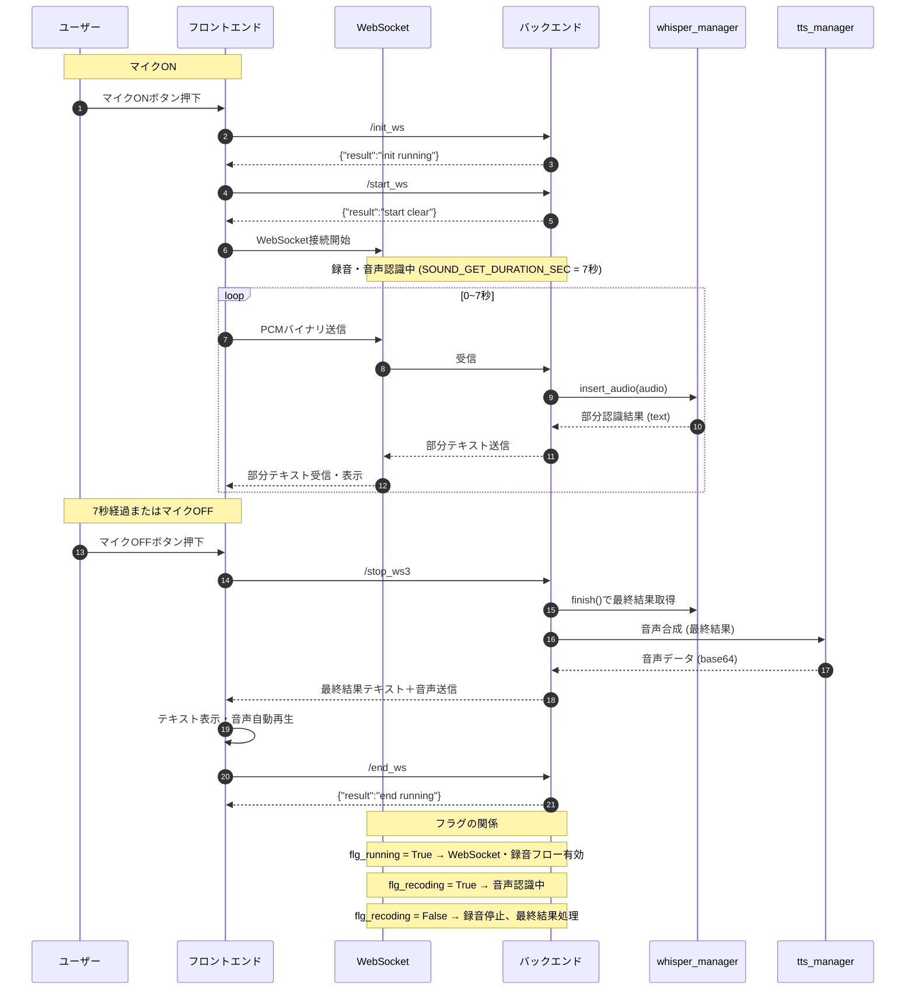

# 1. マイクオン時
## フロント
   - ボタン押下でマイクオン → AudioRecorder.start() 呼び出し
   - WebSocket 接続開始（`/ws`）
   - `/init_ws` → `/start_ws` を順に呼んでバックエンド側を録音状態にする
   - マイク入力を PCMバイナリ で WebSocket に送信

## バックエンド
   - `flg_running = True` / `flg_recoding = True`
   - WebSocket で受信した音声データを `whisper_manager.insert_audio(audio)` に送信
   - `SOUND_GET_DURATION_SEC` が経過するまで音声認識を継続
   - 結果は部分テキスト（途中経過）として WebSocket でフロントに送信

- チャットの最中は「常時音声認識状態」で、リアルタイムで部分テキストが更新されるイメージ。

# 2. マイクオフ時
## フロント
   - ボタン押下で `AudioRecorder.stop()`
   - `/stop_ws3` → `/end_ws` を呼ぶ

## バックエンド
   - `flg_recoding = False` / `flg_running = False`
   - 音声認識の最終結果を `whisper_manager.finish()` で取得

- WAV保存・音声合成などの後処理を行い、フロントに最終結果（テキスト＋音声）を返す

## フロント
   - 受け取った音声データを再生し、テキストを表示

- チャットの一連の流れが終了

# 3. まとめ
- マイクオン → 常時接続 & 音声認識
- マイクオフ → 録音停止 & 最終結果受信
- チャットの最中はリアルタイムで部分テキストを受け取れる
- SOUND_GET_DURATION_SEC で内部的に音声認識の停止タイミングを制御

# flg_running の役割
- バックエンド側の全体的な「録音／認識フローが動作中かどうか」を示すフラグ  

## True の場合
   - WebSocket が接続されており音声認識処理の準備が整っている状態
   - `/start_ws` によって `flg_recoding` が True になるまでは録音開始待ち

## False の場合
   - 録音や音声認識処理を中断してよい
   - `/end_ws` によってフラグがリセットされる

## フラグ : 意味
- flg_running : WebSocket録音処理の全体が「動作可能」かどうか
- flg_recoding : 実際にマイク入力を受け取って音声認識をしている状態かどうか
- マイクオン時：`flg_running = True`、`flg_recoding = True`（録音中）
- マイクオフ時：`flg_recoding = False` → 音声認識終了待ち → `/end_ws` で `flg_running = False`
- flg_running は「WebSocketでのやり取り・録音フロー全体が有効かどうか」を表すフラグ
- WebSocketの接続そのものではなく、処理状態の管理用フラグ
- フロントでマイクオン/オフを制御する際に /init_ws//start_ws と /stop_ws//end_ws に対応して変化する


```
┌───────────────────────────┐
│  マイクOFF状態              │
│  flg_running = False        │
│  flg_recoding = False       │
└─────────────┬─────────────┘
              │ マイクON押下
              ▼
┌───────────────────────────┐
│  初期化状態                │
│  /init_ws                 │
│  flg_running = True       │
│  flg_recoding = False     │
└─────────────┬─────────────┘
              │ /start_ws 呼び出し
              ▼
┌───────────────────────────┐
│  録音・音声認識中           │
│  flg_running = True       │
│  flg_recoding = True      │
│  └─ 音声データを whisper_manager に送信
│  └─ 部分結果をリアルタイムでUIに送信
└─────────────┬─────────────┘
              │ マイクOFF押下
              ▼
┌───────────────────────────┐
│  録音停止・最終結果取得中   │
│  flg_running = True       │
│  flg_recoding = False     │
│  └─ whisper_manager.finish() で最終結果
│  └─ TTS処理やWAV保存
└─────────────┬─────────────┘
              │ /end_ws 呼び出し
              ▼
┌───────────────────────────┐
│  マイクOFF状態             │
│  flg_running = False      │
│  flg_recoding = False     │
└───────────────────────────┘

```




### ポイント
- **ループ内で部分テキストを常時送信**：SOUND_GET_DURATION_SEC の間だけ `insert_audio()` と `get_result()` を回す  
- **マイクOFF**で強制終了も可能  
- **フラグ管理**も注釈で明示しているため、READMEで理解しやすい  

---
